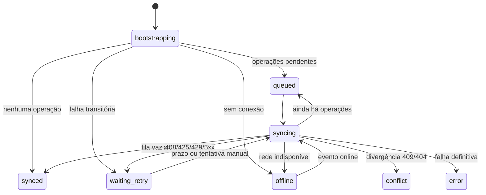

# ADR-004 — Máquina de sincronização e fila durável

- Status: aceito
- Data: 2026-08-11

## Contexto

O autosave anterior enviava o snapshot atual diretamente após um debounce. Uma queda de rede, fechamento da aba ou reinício durante a requisição podia deixar alterações apenas no cache local, sem uma representação durável do trabalho pendente nem política consistente de retry.

## Decisão

- Toda alteração local gera uma operação de estado desejado `upsert` ou `delete` antes do envio à API.
- A fila é armazenada no IndexedDB `moctes-document-sync` e isolada pela chave usuário/workspace.
- Existe no máximo uma operação pendente por documento e escopo; novas alterações substituem o estado desejado anterior.
- Cada atualização da operação recebe uma revisão. A conclusão de uma requisição só remove a fila se a revisão ainda for a mesma, impedindo que uma resposta antiga apague trabalho novo.
- A máquina possui estados explícitos para bootstrap, fila, envio, sucesso, espera de retry, offline, conflito e erro definitivo.
- Falhas de rede, `408`, `425`, `429` e `5xx` usam backoff exponencial com jitter, limitado a 60 segundos. `Retry-After` é respeitado quando enviado pela API.
- `409` não entra em retry infinito. O cliente relê o documento: se o conteúdo remoto já for igual ao desejado, considera a operação concluída; caso contrário, sinaliza conflito.
- Ao reiniciar, o cliente carrega a fila, busca as versões remotas e sobrepõe as operações pendentes antes de renderizar e drenar o trabalho.

## Estados

## Consequências

- Alterações pendentes sobrevivem ao reinício do serviço de sincronização e da página.
- O envio continua serial por workspace, preservando a ordem e a versão otimista do servidor.
- O indicador visual passa a mostrar fila, envio, offline, retry, conflito e erro.
- A fila ainda guarda o documento completo desejado. Patches remotos, Background Sync via service worker e resolução assistida de conflitos são evoluções posteriores.
