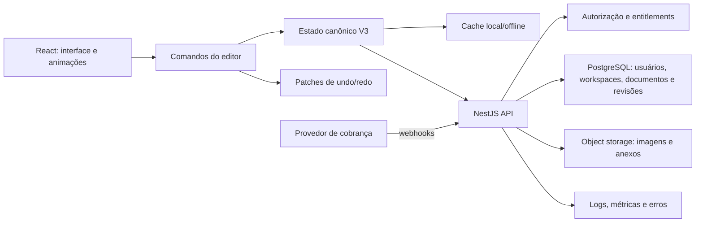

# Roadmap técnico do Moctes

## Diagnóstico executivo

O projeto já é um monólito modular funcional: editor React, domínio e histórico por patches, sincronização offline, API NestJS, PostgreSQL, autenticação por sessão, workspaces, autorização, object storage, worker seguro de imagens e colaboração em tempo real. A estabilização de agosto de 2026 adicionou exclusão recuperável, validação estrutural no servidor, conflitos operacionais explícitos, revalidação de sockets, paginação de assets, readiness e limites de tráfego.

A base técnica permite evoluir para SaaS sem recomeçar. As lacunas de produto mais importantes agora são billing/entitlements, recuperação e verificação de conta, política explícita de CSRF e observabilidade externa. Microserviços, WebGL e CRDT global continuam sem evidência que justifique o custo.

## Ordem de execução

| Ordem | Entrega                               | Motivo                                                 | Critério de conclusão                                                                                  |
| ----- | ------------------------------------- | ------------------------------------------------------ | ------------------------------------------------------------------------------------------------------ |
| 0     | Modelo canônico do caderno            | Elimina divergência entre páginas, seções e divisórias | Página existe uma vez em `document.pages`, aponta para `sectionId` e documentos antigos migram para V3 |
| 1     | Camada de comandos do editor          | Desacopla UI, domínio, histórico e sincronização       | Toda mutação relevante passa por comandos testáveis; undo/redo deixa de clonar todos os documentos     |
| 2     | Persistência vertical no backend      | Substitui `localStorage` como fonte de verdade         | Usuário autenticado cria, abre, altera e reabre um caderno salvo no PostgreSQL                         |
| 3     | Autosave e concorrência               | Evita perda e sobrescrita silenciosa                   | Debounce, indicador de estado, retry, idempotência e controle otimista por versão                      |
| 4     | Autenticação, workspace e autorização | Cria isolamento real entre clientes                    | Sessão segura, memberships, papéis e testes contra acesso cruzado                                      |
| 5     | Arquivos e mídia                      | Retira blobs do documento e do banco principal         | Upload direto para object storage, URLs assinadas, limites e limpeza de órfãos                         |
| 6     | Assinatura e entitlement              | Monetiza sem espalhar regras de plano pela UI          | Checkout, portal, webhooks idempotentes, estados da assinatura e limites validados no servidor         |
| 7     | Performance e observabilidade         | Garante fluidez e operação do produto                  | Metas mensuradas, erros rastreados, logs estruturados e métricas de autosave/API                       |
| 8     | Compartilhamento e colaboração        | Evolui com uma base já consistente                     | Primeiro leitura/comentários; depois presença e edição simultânea com protocolo próprio ou CRDT        |

## Ciclo 0 — estabilizar o domínio

- [x] Criar schema V3 canônico.
- [x] Remover `pages` de `NotebookSection`.
- [x] Adicionar `Page.sectionId` como vínculo canônico.
- [x] Migrar documentos V1/V2 sem perder IDs ou elementos.
- [x] Atualizar store, superfícies, validação e componentes.
- [x] Manter os 140 testes existentes passando.
- [x] Separar `useDocumentStore` em comandos de domínio e adaptador Zustand.
- [x] Representar histórico com comandos inversos ou patches por documento.
- [ ] Adicionar testes de propriedades para migração, ordenação e undo/redo.
- [x] Definir limites de tamanho: 1.000 páginas, 5.000 elementos por página, 50.000 por documento e retenção de 100 revisões.

## Ciclo 1 — primeiro fluxo persistido ponta a ponta

O objetivo não é criar todas as tabelas do produto. É entregar uma fatia vertical completa:

1. [x] Definir `User`, `Workspace`, `Membership` e `Document` no Prisma.
2. [x] Adicionar autenticação e guards globais no NestJS.
3. [x] Criar endpoints de listar, criar, abrir e salvar documento.
4. [x] Usar uma coluna de versão para concorrência otimista.
5. [x] Persistir o conteúdo canônico V3 em JSONB nesta primeira fase.
6. [x] Trocar a inicialização do frontend por cache local + sincronização remota por workspace.
7. [x] Exibir estados `salvando`, `salvo`, `offline` e `conflito`.
8. [x] Cobrir autenticação, persistência e autorização com testes E2E.
9. [x] Adicionar `DocumentRevision`, restauração recuperável e resolução explícita de conflitos.
10. [x] Limitar o histórico recuperável às 100 revisões mais recentes por documento.

Usar JSON para o conteúdo do editor é aceitável inicialmente. Metadados consultáveis, propriedade, memberships, revisão e cobrança devem continuar relacionais. Só vale normalizar páginas e elementos quando consultas, colaboração ou volume provarem essa necessidade.

## Ciclo 2 — produto SaaS

- [x] Criar workspace pessoal por usuário e preparar memberships de equipe.
- [x] Implementar papéis `owner`, `admin`, `editor` e `viewer` no servidor.
- [x] Criar `Asset` relacional e upload direto assinado para object storage.
- [x] Integrar cache offline, canonicalizar referências e migrar assets locais legados.
- [x] Adicionar cotas, limpeza periódica, logs estruturados e testes de segurança do upload.
- [x] Adicionar processamento assíncrono, inspeção de conteúdo, antivírus, sanitização de SVG e thumbnails WebP/AVIF.
- Integrar checkout e portal de assinatura.
- Processar webhooks com tabela de eventos e chave única para idempotência.
- Centralizar capacidades em um serviço de entitlement, por exemplo `canCreateDocument`, `maxStorageBytes` e `canCollaborate`.
- Definir estados explícitos para trial, ativo, inadimplente, cancelado e período de tolerância.
- Oferecer exportação e exclusão de conta/dados desde a primeira versão paga.

## Ciclo 3 — fluidez e escala do editor

- [x] Medir abertura, arraste, resize, memória, Zustand, renders, fila offline e conflitos em cenários reproduzíveis.
- [x] Reduzir assinaturas amplas do Zustand com seletores por elemento e memoização do renderer.
- [x] Separar estado efêmero de interação do estado persistido.
- [x] Atualizar previews durante drag/resize e consolidar o comando persistido ao final.
- Virtualizar páginas e elementos fora da área visível quando os testes de carga mostrarem necessidade.
- Dividir o CSS global por domínio e impor orçamento para bundle e memória.
- Manter o DOM enquanto cumprir a meta. Avaliar Canvas/WebGL apenas com profiling que demonstre o gargalo.

Metas iniciais sugeridas:

- feedback visual de interação em até 16 ms na maior parte dos frames;
- abertura de um documento comum em até 2 s numa conexão móvel razoável;
- confirmação local de edição imediata e autosave remoto normalmente em até 1 s;
- nenhum documento perdido em refresh, queda de rede ou retry do servidor.

## Colaboração: sequência segura

1. [x] Link compartilhável somente leitura.
2. [x] Convite e permissões.
3. [x] Comentários assíncronos.
4. [x] Presença e cursores.
5. [x] Edição simultânea por operações versionadas, com conflito explícito em caminhos sobrepostos.

Antes da etapa 5, os comandos precisam ter IDs estáveis, ordenação determinística, versionamento e testes de conflito. Nesse ponto deve-se comparar uma solução CRDT madura, como Yjs, com um protocolo de operações no servidor. Essa decisão deve vir de um protótipo com documentos reais, não apenas da semelhança desejada com Figma/FigJam.

## Arquitetura-alvo inicial

## Decisões que devem ser evitadas agora

- Não dividir o backend em microserviços.
- Não tornar o estado do provedor de pagamento a fonte de verdade da autorização.
- Não sincronizar o documento inteiro em cada frame de arraste.
- Não armazenar imagens em base64 dentro do JSON do documento.
- Não iniciar colaboração em tempo real antes de autosave, versões e conflitos estarem sólidos.
- Não trocar o renderer DOM apenas por expectativa de escala; medir primeiro.

## Próxima tarefa de implementação

A fila durável, a resolução de conflitos, as revisões recuperáveis, o upload direto, o cache offline, as cotas, a limpeza, o processamento seguro de assets e a colaboração já estão implementados e estabilizados. O próximo passo de produto é assinatura, billing e entitlements por workspace; antes de produção também entram recuperação/verificação de conta, CSRF explícito e telemetria externa.
